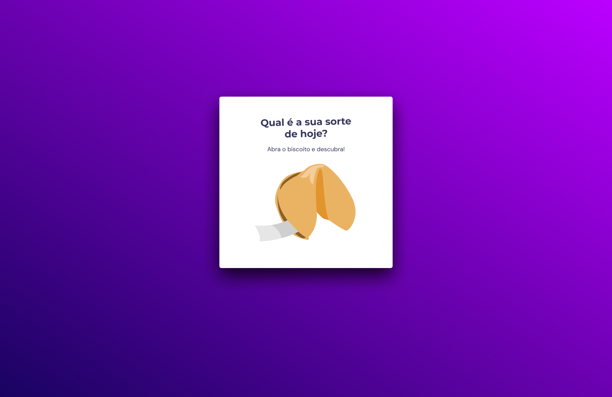

<h1 align="center">BISCOITO DA SORTE</h1>

Programa exclusivo, promovido pela Rocketseat para ensino de tecnologias WEB.  

  <a href="#-tecnologias">Tecnologias</a>&nbsp;&nbsp;&nbsp;|&nbsp;&nbsp;&nbsp;
  <a href="#-projeto">Projeto</a>&nbsp;&nbsp;&nbsp;

 

  

## 🚀 Tecnologias

Esse projeto foi desenvolvido com as seguintes tecnologias:

- HTML e CSS
- Javascript
- Git e Github
- Figma

## 💻 Projeto

BISCOITO DA SORTE é um projeto feito com intuito de aperfeiçoar e praticar o que foi ensinado nas aulas do stage 05 da trilha explorer colocando JavaScript em pratica.

- [Acesse o projeto finalizado, online](https://marcioedu.github.io/biscoito-sorte/)

---

Feito com ♥ by Rocketseat Trilha Explorer [Participe da nossa comunidade!](https://discord.gg/rocketseat)